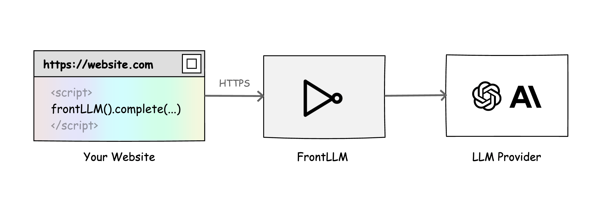

# FrontLLM

FrontLLM is your public gateway to LLMs. Request LLM directly from your front-end code. No backend needed.

### 👀 Demos

* [Explain This](https://frontllm.com/docs/demos/explain-this)
* [Streaming](https://frontllm.com/docs/demos/streaming)
* [Translator](https://frontllm.com/docs/demos/translator)

## 🚀 Installation

To use FrontLLM in your project, you can install it via npm:

```bash
npm install frontllm
```

Now you can import the library and create an instance of the gateway with your specific gateway ID:

```js
import { frontLLM } from 'frontllm';
const gateway = frontLLM('<gateway_id>');
```

## 🎬 Usage

Chat Completion:

```js
const gateway = frontLLM('<gateway_id>');
const response = await gateway.complete('Hello world!');
console.log(response.choices[0].message.content);
```

Chat Completion with Streaming:

```js
const gateway = frontLLM('<gateway_id>');
const response = await gateway.completeStreaming('Where is europe?');
for (;;) {
  const { finished, chunks } = await response.read();
  for (const chunk of chunks) {
    console.log(chunk.choices[0].delta.content);
  }
  if (finished) {
    break;
  }
}
```

## 💡 License

This project is released under the MIT license.
